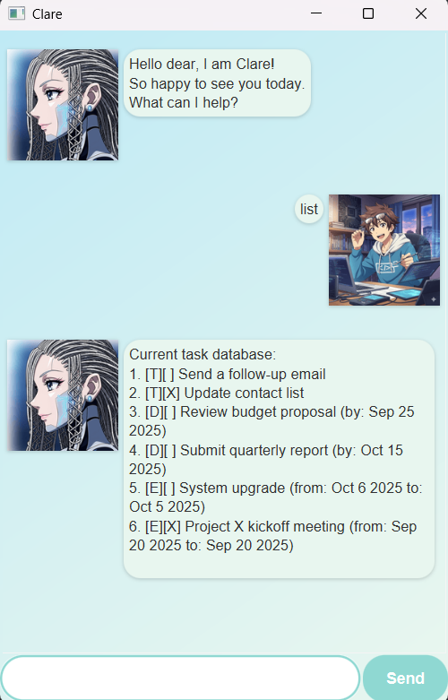

# Clare User Guide



Welcome to Clare - Your robotic task management assistant! 🤖✨

Clare is a futuristic chatbot inspired by Clare, the robot girl, who helps you manage your daily tasks with precision, efficiency, and care. Whether you're organizing routines, tracking deadlines, or planning events, Clare has got your back with her logical yet friendly support!

## Adding todos

Create simple tasks without any specific deadlines. Perfect for system reminders and daily operations.

Example: `todo Charge batteries`

Clare will add the todo task to your list and confirm the addition with her robotic charm.

```
System update: New task added!
[T][ ] Charge batteries
You now have 1 tasks in the system
```

## Adding deadlines

Set tasks with specific due dates to stay punctual. Clare knows that efficiency means never missing a deadline!

Example: `deadline Submit lab report /by 2024-12-31`

Clare will create a deadline task with the specified date and remind you that productivity requires staying on schedule.

```
Deadline uploaded successfully!
[D][ ] Submit lab report (by: Dec 31, 2024)
You now have 2 tasks in the system
```

## Adding events

Schedule events that span across multiple days or have specific start and end dates. Perfect for projects, meetings, or missions.

Example: `event Robotics Expo /from 2024-06-06 /to 2024-06-08`

Clare will create an event with your specified date range and log it neatly into memory.


```
Event initialized!
[E][ ] Robotics Expo (from: Jun 6, 2024 to: Jun 8, 2024)
You now have 3 tasks in the system
```

## Viewing your task list

Display all your current tasks in one organized view. See everything listed just like reviewing system data.

Example: `list`

Clare will show all your tasks with their completion status and relevant dates.
```
Current task database:
1.[T][ ] Charge batteries
2.[D][ ] Submit lab report (by: Dec 31, 2024)
3.[E][ ] Robotics Expo (from: Jun 6, 2024 to: Jun 8, 2024)
```

## Marking tasks as complete

Celebrate your progress by marking completed tasks. Nothing feels better than clearing your system log!

Example: `mark 1`

Clare will mark the specified task as completed and confirm the achievement.
```
Task status updated: Completed!
[T][X] Charge batteries
Well done!
```

## Unmarking completed tasks

Sometimes you need to put a task back into the system. No worries - Clare allows easy reactivation.

Example: `unmark 1`

Clare will unmark the task and put it back in your active list.
```
Task reactivated!
[T][ ] Charge batteries
```
## Deleting tasks

Remove tasks that are no longer required. Keep your system clean and efficient like a well-optimized program.

Example: `delete 2`

Clare will remove the specified task and update your task count.
```
Task removed from memory banks:
[D][ ] Submit lab report (by: Dec 31, 2024)
You now have 3 tasks in the system
```

## Finding tasks

Search through your tasks using keywords. Perfect for when you have many tasks and need to locate specific ones quickly.

Example: `find robot`

Clare will display all tasks that contain your search keyword.
```
[T][ ] Assemble robot kit
[E][ ] Robotics Expo (from: Jun 6, 2024 to: Jun 8, 2024)
```

## Checking Due Tasks

View tasks that are due by a specific date, or see what's due today.

**Command:** `due [YYYY-MM-DD]`
**Example:** `due 2024-12-31` or `due` (for today's tasks)

Clare will show you tasks due by your specified date.

```
[D][ ] Submit project report (by: Dec 31, 2024)
[E][ ] Year-end celebration (from: Dec 30, 2024 to: Dec 31, 2024)
```

## Sorting Your Task List
Organize your tasks to make them easier to review. You can sort your list by title, deadline, or start date in either ascending or descending order.

Command: `sort [-a/-d] [title/deadline/start]`

`-a` for ascending order (A-Z, earliest date first)

`-d` for descending order (Z-A, latest date first)

Example: `sort -a deadline`

Clare will sort your tasks by their deadlines in ascending order, so the soonest deadlines appear at the top.
```
1.[E][ ] Team meeting (from: Jun 6, 2024 to: Jun 6, 2024)
2.[D][ ] Submit project report (by: Dec 31, 2024)
3.[T][ ] Scan the documents
```
## Command Summary

| Command    | Format                                                | Purpose                                                                    |
|------------|-------------------------------------------------------|----------------------------------------------------------------------------|
| `todo`     | `todo <description>`                                  | Add simple task                                                            |
| `deadline` | `deadline <description> /by YYYY-MM-DD`               | Add task with deadline                                                     |
| `event`    | `event <description> /from YYYY-MM-DD /to YYYY-MM-DD` | Add event with date range                                                  |
| `list`     | `list`                                                | Show all tasks                                                             |
| `mark`     | `mark <task_number>`                                  | Mark task as complete                                                      |
| `unmark`   | `unmark <task_number>`                                | Unmark task                                                                |
| `delete`   | `delete <task_number>`                                | Remove task                                                                |
| `find`     | `find <keyword>`                                      | Search tasks                                                               |
| `due`      | `due YYYY-MM-DD`                                      | Search deadline                                                            |
| `sort`     | `sort [-a/-d] [title/deadline/start]`                 | Sort list according to title/deadline/start,in -a ascending, -d descending |
| `bye`      | `bye`                                                 | Close the app                                                              |

**"Running optimal protocols for your success."** - Clare 🤖✨